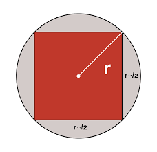

# GIS Proximity Endpoint - Golang & PostgreSQL

Given a location,radius and search area type, this endpoint will return locations from a PostgreSQL database (can be migrated to other RDBMS) in json format for further management.

This endpoint will return the locations within this radius and area type. Additionally, we can set a parameter representing the distance at which we don't sort by distance but rather by rating.

# Setup

Set DB config in main.go

Build and run: 
```bash
git clone https://github.com/KenanBouvier/GIS-proximity-endpoint.git
cd GIS-proximity-endpoint
go run *.go
```


Send test request to endpoint with Curl:
```bash

curl --location --request GET 'http://localhost:8080/proximity' \
--header 'Content-Type: application/json' \
--data-raw '{
    "longitude":-1.5246603,
    "latitude":53.3685,
    "radius":500,
    "type":"circle"
}'

```

# Algorithm Overview: Circle & Square Handlers 
Brief overview of handler operations:
- For Circle: Get distance between both points. As center position to boundary/radius is always constant
- For Square: Create box boundary from center position with radius to determine intersection with each spot location

The time complexity for circle handler is constant.
Although the time complexity for the square handler is also constant, it has a very noticable factor of about 4x slower.
The inherent slower computation with squares instead of circles is that the valid area is different depending on the angle we are directing towards. Unlike a circle in which at every angle the valid distance is constant.

To make our square handler more efficient, we can assume a circle from the square. A circle that contains the whole square. Else we are removing valid areas that should be considered.
Therefore our new circle will have radius of the furthest distance from the center any border of the square. This is the corner of the square.
This is also sqrt(2)*halfLengthOfSquare which in our case = the inputted radius parameter.



Given the nature of this specific endpoint, the majority of our spots in our db will not fall within the supplied radius. Therefore an overwhelming number of operations will be dealt with using this outer circle and by consequence, increase efficiency. 

One extra thing I included was that if the data was within our larger circle(squarehandler) then we can also skip our squarehandler operations if the smaller circle within the square contained our spot. This way we can instantly know. This leaves an even smaller area of locations that will rely on the square handler.


## Performance
### Time to complete request - (Before Efficient Algorithm)
#### First 5 requests for circle last 5 requests for square (~2 seconds)


### Time to complete request - (With Efficient Algorithm)
#### All 5 requests for square


We can see that the inefficiences involved with square lookups have now become non-existent and are the same as the circle lookup.

## Data management & Sorting Control Flow
To manage the final returned object of this request, initially we are going to have two objects: within50 and outside50.
They represent spots that are within and outside 50 metres from our supplied point respectively (considering radius param).

Sorting each of these objects as such:
- within50 -> sorted by rating
- outside50 -> sorted by distance
To do the sort by distance, as distance is not a field in our data, I have created an array of type spotDistance with this added field. 
That way I am able to sort with ease before finally iterating through and removing that field. 

Once we have both of these sorted we can now append them together as so:

finalResult = append(within50,outside50...);
This will get us the final form we want to finally return through json 
